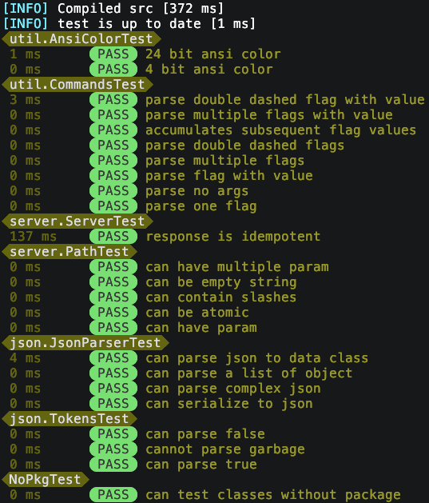

# klib
A simple kotlin library for building a simple http server and client.

Strives to be simple and easy to use, with minimal dependencies..

## Development
Build with nob.kt, no IDE required.

### Build
  - `./nob`             # build src

### Test
  - `./nob test`        # build test and run tests. Run `./nob test -h` for help.



### DocGen
Generate man-pages, example for these two files: 
> ./nob doc src/doc/DocGen.kt src/doc/KotlinParser.kt
Will output man1/docgen.1 and man1/kotlinparser.1


```
.
├── nob             # nob bootstrap/cli
├── nob.kt          # nob src and config
├── .res            # resources
│   └── log.conf    # log configuration
├── test
│   └── ...
└── src
    ├── client
    ├── examples
    ├── json
    ├── parser
    ├── serde
    ├── server
    ├── test
    └── util
```

# Roadmap
- [x] HTTP Client
- [x] HTTP Server
- [x] IDE independent builds
- [ ] generate man pages for kdoc
    - [x] summarize from file containing main()
    - [x] list class, data class, data object, object
    - [x] list functions
    - [ ] list global constants
    - [x] generate one page per source-file
- [ ] JDBC driver (postgres)
- [x] Logging support
    - [x] Console log
    - [ ] JSON log
    - [ ] File log
- [ ] Kafka?
- [ ] OAuth2
- [x] Parser Combinator
- [x] Rust-like Result type
- [x] Serializer and Deserializer
    - [x] JSON serde
    - [ ] XML serde
- [x] Test enginge
    - [x] Output result to console (hide test print/log/errors in console)
    - [ ] Output result to file (test println/log/errors console)
- [x] neotest adapter

